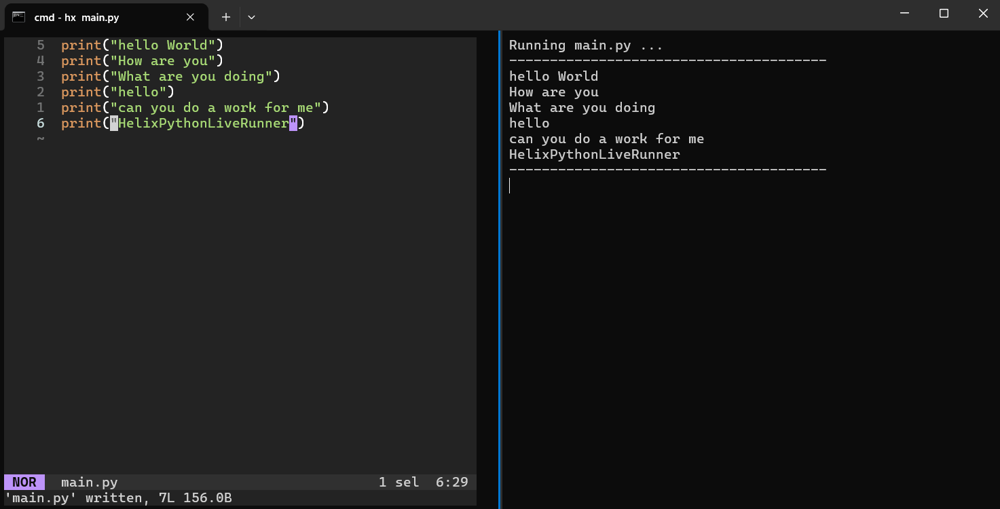

#  🐍 HelixPythonLiveRunner
A simple and fast **live Python runner inside Helix** using Windows Terminal.
Edit your file in Helix (left pane) and instantly see your output update (right pane) perfect for Python learners!

---

## 🚀 Features
- Works entirely with built-in Windows + Python tools
- Fully refreshed output window on each run
- Auto-runs Python script on every save  
- Split view: code (left) + output (right)  
- Works directly with **Helix editor**
- No external tools needed  
- Easy one-click setup
---

### 📂 Folder Structure

Your setup folder should look like this:

```
C:\Users\<YourName>\Desktop\Python Learning\
│
├── main.py                # Your main Python file
├── watch.py               # Auto-reload watcher
└── pythonLearning.bat     # Launcher script
```

---

### ⚙️ Setup Steps

1. **Clone or Download this repository**

   ```bash
   git clone https://github.com/atiquz/HelixPythonLiveRunner.git
   ```

2. **Move the folder (optional)**
   You can place it anywhere, but the default setup assumes:

   ```
   C:\Users\<YourName>\Desktop\Python Learning
   ```

3. **Open `pythonLearning.bat` and adjust paths (if needed)**
   If you moved the folder, edit the `.bat` file and change:

   ```
   cd /d "C:\Users\<YourName>\Desktop\Python Learning"
   ```

   to your folder’s location.

4. **Double-click `pythonLearning.bat`**

   * Left pane → Helix opens with `main.py`
   * Right pane → Starts watching and auto-running on every save

5. **Start coding!**
   Each time you press **Ctrl+S** in Helix, the right pane will refresh:

   ```
   Running main.py ...
   ---------------------------------------
   [your script output here]
   ---------------------------------------
   ```

---

### 🧩 Customization

* To change which file is auto-run, edit this line in `watch.py`:

  ```python
  MAIN = ROOT / "main.py"
  ```

  Example:

  ```python
  MAIN = ROOT / "app.py"
  ```

* To change refresh speed:

  ```python
  POLL_INTERVAL = 0.2  # seconds
  ```

* To watch only certain folders or exclude files, adjust the `gather_files()` function.

---

### 🚀 Example Workflow

1. Open the project by double-clicking `pythonLearning.bat`
2. Write Python code in Helix
3. Save (`Ctrl + S`)
4. Instantly see results refresh on the right pane

---

### 🧠 Notes

* Works best on **Windows Terminal**, not old `cmd.exe`
* No external libraries — 100% standard Python
* You can modify the `.bat` to open other editors or shells if desired

---

## 🧩 Requirements

Before running, make sure you have the following installed:

| Tool | Description | Download |
|------|--------------|-----------|
| 🖋️ [Helix Editor](https://helix-editor.com/) | For writing and editing Python code. | Official site |
| 🐍 [Python 3.x](https://www.python.org/downloads/) | For running your Python scripts. | python.org |
| 🪟 [Windows Terminal](https://aka.ms/terminal) | For split-pane live output. | Microsoft Store |

> ⚠️ Make sure all of the above tools are **added to your system PATH**.

✅ Once setup is complete — just code, save, and see instant results side by side!

---

### 💬 Credits

Made by **Md Atiquz Zaman**
Repository: [HelixPythonLiveRunner](https://github.com/atiquz/HelixPythonLiveRunner)

---

### 📸 Screenshot



